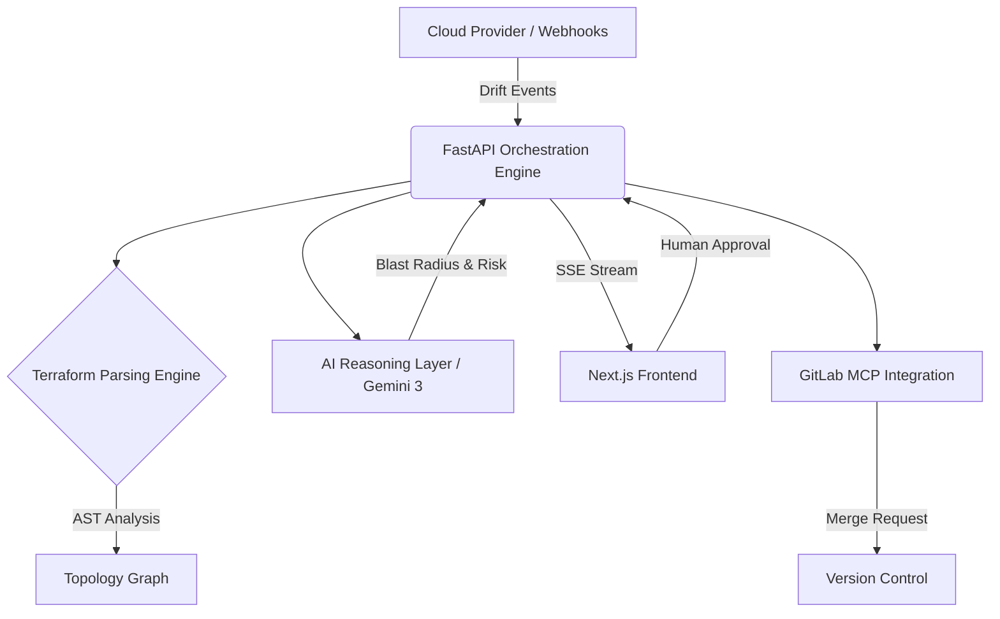

# ZeroDrift Architecture & System Design

**Version:** 2.1.0  
**Status:** Production (Internal)  
**Author:** ZeroDrift Platform Architecture Team  

> This document provides a comprehensive architectural blueprint of the ZeroDrift autonomous operations platform. It is intended for Principal Engineers, Site Reliability Engineers (SREs), Platform Architects, and Cloud Operators. 

---

## 1. Introduction

Modern cloud infrastructure is scaling faster than human operational capacity. Organizations manage thousands of Kubernetes clusters, sprawling Terraform state files, complex CI/CD pipelines, and multi-cloud networks. As scale increases linearly, operational toil scales exponentially.

**ZeroDrift** exists to bridge the gap between reactive observability and autonomous self-healing. While traditional observability platforms alert engineers when infrastructure drifts from its desired state, ZeroDrift autonomously detects the drift, calculates the blast radius, reasons about the root cause using deterministic AI, and proposes a safe, executable infrastructure patch (Merge Request).

The core philosophy of ZeroDrift is **operational trust**. Autonomous infrastructure changes without human oversight lead to chaos. ZeroDrift relies on a strict "Human-in-the-Loop" execution model, ensuring that while the discovery, reasoning, and coding are automated, state mutation requires explicit human approval.

---

## 2. High-Level System Overview

The ZeroDrift platform is a distributed control plane consisting of five major tiers:

1. **The Intelligence Frontend (Next.js):** A highly performant, streaming-first React application providing the Command Center, real-time topology visualization, and approval workflows.
2. **The Orchestration Engine (FastAPI):** A high-concurrency Python backend serving as the central nervous system, managing state, routing events, and enforcing policy.
3. **The Terraform Parsing Engine:** A recursive Abstract Syntax Tree (AST) parser that analyzes HCL code, resolves modules, and builds dependency graphs.
4. **The AI Reasoning Layer (Gemini 3):** An advanced deterministic model integrated via the Google Cloud Agent Builder that evaluates drift, calculates risk, and formulates remediation patches.
5. **The GitOps Execution Layer (GitLab MCP):** A Model Context Protocol integration that securely interfaces with enterprise version control to orchestrate auditable Merge Requests.



---

## 3. Core Architectural Philosophy

Our design decisions are rooted in strict SRE principles:

* **Deterministic Orchestration:** We rely on strict AST parsing for infrastructure state analysis. LLMs are utilized exclusively for reasoning and intent synthesis, never for blind state mutation.
* **Bounded Autonomy:** The system can reason, plan, and propose independently, but the final execution boundary requires cryptographic/human authorization.
* **Git-First Operations:** We do not mutate cloud APIs directly via SDKs. Every remediation is pushed as a Git branch and evaluated via standard CI/CD (GitOps). This ensures auditability and instantaneous rollback capability.
* **Explainable Remediation:** An alert is useless if the operator cannot understand why the AI chose a specific remediation path. Every proposed fix includes a granular blast radius analysis.

---

## 4. Frontend Architecture

The frontend is built on **Next.js (App Router)** and React 19, designed for extreme data density and low-latency updates.

* **UI/UX:** Styled using Tailwind CSS and Framer Motion, utilizing an enterprise "dark mode" aesthetic (`bg-obsidian`) to minimize eye strain during incident response.
* **Component Architecture:** We favor a strict separation of concerns. Server Components handle initial data hydration, while Client Components (`"use client"`) manage real-time WebSocket/SSE subscriptions and interactive state (e.g., Topology Graphing).
* **Streaming Updates:** Instead of expensive HTTP polling, the frontend subscribes to a persistent Server-Sent Events (SSE) connection (`/api/v1/stream/events`). As the backend processes drift events, the UI updates instantly—creating a seamless operational stream.
* **State Management:** Handled locally via React state and globally via React Query, ensuring aggressive caching and rapid refetching upon human action.

---

## 5. Backend Architecture

The backend is built on **FastAPI (Python 3.12+)**, chosen for its rigorous type safety (Pydantic), asynchronous I/O capabilities, and massive concurrency scaling.

* **API Design:** RESTful endpoints (`/api/v1/*`) combined with asynchronous event streams. 
* **State Persistence:** Backed by an atomic SQLite ledger (`zerodrift_audit_ledger.db`) for rapid localhost execution, architected to swap transparently to PostgreSQL for clustered deployments.
* **Background Tasks:** Long-running operations (like traversing multi-module Terraform repositories or querying Gemini) are offloaded to background threads to prevent event-loop blocking.
* **Event Pipeline:** Inbound webhooks trigger a state machine. The event is normalized, passed to the Terraform engine for context hydration, sent to the AI for reasoning, and finally emitted to the frontend via the SSE dispatcher.

---

## 6. Terraform Intelligence Engine

ZeroDrift does not rely on naive string matching. It operates a **Recursive HCL Parser** (`python-hcl2`).

When drift is detected (e.g., an EKS Node Group desired capacity was manually altered from `3` to `10` via the AWS Console):
1. **Module Resolution:** The engine recursively crawls the repository (`terraform/environments/prod/*.tf`), resolving nested modules and variable interpolations.
2. **State Comparison:** It compares the detected cloud state against the parsed static HCL definition.
3. **AST Mutation:** To generate a remediation patch, the engine deterministically alters the AST and serializes it back to HCL, ensuring whitespace and formatting preservation.

*Enterprise capability:* This engine is designed to handle sprawling, deeply nested Terraform monolithic structures common in large enterprises, strictly bounding its search space based on the event context.

---

## 7. Infrastructure Topology Engine

Remediation without context causes outages. To prevent this, ZeroDrift implements a dynamic Topology Engine.

* **Graph Generation:** By parsing Terraform resource references (e.g., `aws_autoscaling_group.app_asg.name`), the backend builds a Directed Acyclic Graph (DAG) of the infrastructure.
* **Blast Radius Analysis:** If the AI proposes tearing down a subnet to fix a drift issue, the topology engine traverses the graph edges to identify all dependent resources (RDS clusters, Load Balancers, EKS Nodes). 
* **Risk Propagation:** The total risk score is a function of the node's inherent criticality multiplied by the density of its downstream dependencies.

---

## 8. AI Orchestration Architecture

ZeroDrift utilizes **Gemini 3** via the **Google Cloud Agent Builder**.

We enforce **Bounded Autonomy**. The AI is not given root cloud credentials. Instead, it is given:
1. The normalized drift event.
2. The current Terraform HCL chunk.
3. The topology dependency graph.

The AI is instructed to act as a Principal SRE. It must return a structured JSON response containing:
* `root_cause_analysis`: Why did this happen?
* `blast_radius_impact`: What breaks if we fix this?
* `remediation_steps`: Human-readable steps.
* `hcl_patch`: The deterministic code fix.

This structured enforcement prevents hallucinated infrastructure changes and ensures the remediation is completely explainable to the human operator.

---

## 9. GitOps & Remediation Workflow

The remediation lifecycle is strictly governed:

1. **Detection:** Webhook receives a drift event (e.g., `aws_autoscaling_group` capacity changed).
2. **Contextualization:** Topology graph and HCL state are loaded.
3. **Reasoning:** Gemini evaluates risk and writes a Terraform patch.
4. **Approval Routing:** The UI presents the blast radius and diff to the SRE.
5. **Merge Request (Partner Power):** Upon human approval, the GitLab MCP integration is invoked. A new branch is created, the HCL patch is committed, and a GitLab Merge Request is opened.
6. **Execution:** The enterprise's existing CI/CD pipelines run `terraform plan` and apply the change, returning the environment to parity.

---

## 10. Real-Time Streaming Architecture

Polling is an anti-pattern for incident response. ZeroDrift utilizes **Server-Sent Events (SSE)**.

The FastAPI backend maintains a global `EventStreamer` utilizing Python `asyncio.Queue`. When an orchestrator thread finishes analyzing a drift event, it publishes an event payload to the queue. 

The `/api/v1/stream/events` endpoint yields these events to the Next.js frontend as an `application/text-event-stream`. This guarantees that if a massive drift event occurs in production, the Command Center UI turns red instantaneously, minimizing Mean Time To Detect (MTTD).

---

## 11. Observability & Audit Systems

ZeroDrift is a security and compliance platform as much as it is an operational tool.

* **Audit Ledger:** Every action, from automated drift detection to human approvals, is cryptographically logged in the `zerodrift_audit_ledger`.
* **Execution Tracing:** Remediations carry correlation IDs linking the initial cloud webhook, the AI reasoning prompt, the user approval signature, and the GitLab MR URL. This provides end-to-end provenance for SOC2 compliance.

---

## 12. Security Model

* **Execution Boundaries:** ZeroDrift runs with read-only access to the Terraform repository and standard CI/CD permissions to open MRs. It never requires write-access to the live AWS/GCP APIs.
* **Secrets Handling:** Managed entirely via environment variables and injected securely at runtime.
* **Approval Systems:** Human approvals require authenticated sessions (simulated locally, OAuth-backed in production). 

---

## 13. Scalability Considerations

* **Backend Concurrency:** FastAPI running on Uvicorn handles thousands of concurrent SSE connections with negligible memory overhead.
* **Parsing Bottlenecks:** Recursive HCL parsing is CPU-bound. In a massive enterprise repository, this can block the event loop. Future iterations will offload AST parsing to a dedicated Rust-based worker pool (e.g., Celery/Redis).
* **AI Rate Limits:** Heavy drift events can hit LLM rate limits. The orchestration engine implements exponential backoff and jitter for Agent Builder interactions.

---

## 14. Operational Workflow Example

**Scenario: Oversized EKS Node Group**
1. **Event:** A junior engineer manually scales the `prod-eks-workers` ASG to 20 nodes via the AWS console during a traffic spike, but forgets to scale it back down.
2. **Detection:** ZeroDrift receives an AWS EventBridge webhook indicating desired capacity drift.
3. **Parsing:** ZeroDrift reads `terraform/environments/prod/main.tf` and sees the codified capacity is `5`. 
4. **Topology:** It graphs the ASG and recognizes it is tied to a Tier-1 EKS cluster. The blast radius is marked "High".
5. **Reasoning:** Gemini 3 analyzes the state, identifying a $4,500/mo cost leak. It generates an HCL patch to revert capacity to `5`.
6. **Approval:** An SRE reviews the ZeroDrift Command Center. They see the exact cost impact and topology. They click "Approve".
7. **GitOps:** ZeroDrift invokes the GitLab MCP, opens an MR, and the CI/CD pipeline scales the cluster safely back to desired state.

---

## 15. Repository Structure

```text
zerodrift-infra/
├── docs/                      # Architectural documentation & manifestos
├── terraform/                 # The target infrastructure repositories (simulated)
│   └── environments/prod/     # Target environment scanning directory
├── web/                       # Next.js 15+ Frontend (React 19)
│   ├── src/app/               # Application routing and pages
│   ├── src/components/        # Reusable UI, Layouts, and Graphs
│   └── package.json           # Frontend dependencies
├── server_webhook.py          # Core FastAPI Orchestration Engine
├── update_backend.py          # Automated patching scripts
├── .env                       # Environment configuration
└── zerodrift_audit_ledger.db  # SQLite local operational state
```

---

## 16. Engineering Tradeoffs

* **SQLite vs PostgreSQL:** For hackathon velocity and localized testing, we default to SQLite. This sacrifices horizontal backend scaling but drastically improves onboarding speed.
* **AST Parsing Constraints:** We currently use `python-hcl2`. While accurate for standard Terraform, it struggles with highly dynamic `for_each` and nested `dynamic` blocks. A complete implementation requires integration with the native HashiCorp `hcl` Go library.
* **Simulated Webhooks:** For local execution, some cloud events are simulated via background tasks to demonstrate end-to-end functionality without requiring users to provision massive AWS environments.

---

## 17. Future Architecture Roadmap

* **Multi-Cloud Support:** Extending topology graphing to natively parse Google Cloud and Azure resource relationships.
* **Policy Engines:** Native integration with Open Policy Agent (OPA) to mathematically prove a remediation patch does not violate compliance rules before opening an MR.
* **Advanced Edge Compute:** Moving the SSE streaming infrastructure to Cloudflare Workers to reduce load on the primary orchestration engine.

---

## 18. Final Notes

ZeroDrift is a fundamental rethink of infrastructure operations. The goal is not to remove humans from the operational loop, nor to introduce autonomous chaos into fragile systems. 

Our objective is to remove repetitive operational exhaustion. By combining deterministic state parsing with advanced AI reasoning and strict GitOps boundaries, ZeroDrift ensures that infrastructure reliability no longer depends on engineers sacrificing their nights and weekends.

**This is the future of autonomous Site Reliability Engineering.**
