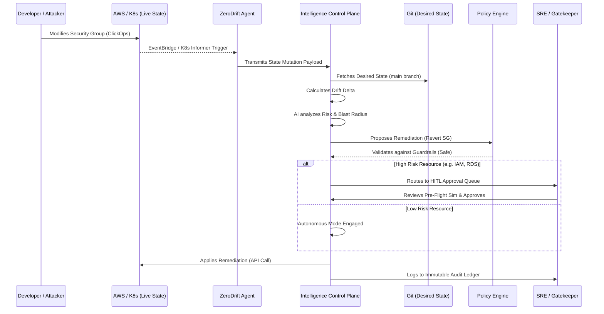

# ZeroDrift — The Autonomous Reliability Control Plane for Modern Cloud Infrastructure

## CONFIDENTIAL INTERNAL MEMORANDUM
**TO:** GitLab CTO Office, Y Combinator Partners, Google Cloud Startups Team, AWS Enterprise Modernization Committee  
**FROM:** Principal Systems Architect / Platform Engineering Evaluator  
**SUBJECT:** Deep Technical Due Diligence & Strategic Architectural Evaluation of ZeroDrift  
**DATE:** Q2 2026  
**CLASSIFICATION:** Highly Confidential - Proprietary Enterprise Evaluation

---

## SECTION 1 — EXECUTIVE SUMMARY

### The Autonomous Reliability Paradigm
ZeroDrift represents a fundamental paradigm shift in how hyperscale and enterprise organizations govern, operate, and remediate cloud-native infrastructure. At its core, ZeroDrift is the **Autonomous Reliability Control Plane** for modern cloud infrastructure. It is not merely another observability dashboard, nor is it a simple infrastructure-as-code (IaC) linter. It is a deterministic, AI-driven remediation engine that closes the gap between intended state (GitOps/Terraform) and actual production reality (Cloud/Kubernetes).

### The Genesis of ZeroDrift
ZeroDrift was born out of profound operational trauma. Over the last decade, the transition to distributed microservices, Kubernetes, and multi-cloud architectures has resulted in an exponential explosion of infrastructure complexity. Teams adopted GitOps and Terraform to manage this complexity, hoping that declaring infrastructure in Git would solve the problem of state management. 

However, the "State Illusion" persists. What is declared in `main.tf` or `deployment.yaml` is rarely the exact reality running in production. Out-of-band changes, emergency hotfixes (ClickOps), legacy automated scripts, and third-party operator mutations constantly alter the live environment. This is known as **Configuration Drift**, and it is the silent killer of production reliability.

Current tooling is painfully insufficient. Observability platforms (Datadog, New Relic) tell you *that* something is broken, but they lack the context of *why* the underlying state changed and *how* to safely revert it. CI/CD platforms (GitLab, GitHub Actions) can push changes, but they are entirely blind to post-deployment mutations. Current IaC tools (Terraform Cloud) can detect drift, but their remediation requires human intervention, pull requests, and manual state reconciliation.

ZeroDrift was created to bridge this chasm. The founder’s vision is singular: **To build an autonomous system that reasons about infrastructure state, mathematically calculates the blast radius of anomalies, and safely auto-remediates drift using bounded, deterministic AI.**

### The Era of Autonomous Operations
We are entering the era of Platform Engineering and Autonomous Operations. With the rise of AI infrastructure (GPU clusters, distributed ML workloads) and hyperscale multi-cloud footprints, the cognitive load on Site Reliability Engineering (SRE) teams has surpassed human capacity. ZeroDrift is the missing orchestration intelligence layer. It sits above Git, above Kubernetes, and above AWS/GCP, acting as the autonomous nervous system that ensures production environments are strictly compliant, continuously optimized, and perfectly aligned with their intended design.

---

## SECTION 2 — THE REAL PROBLEM

### The Cognitive Overload of Modern SRE
To understand the necessity of ZeroDrift, one must intimately understand the daily reality of a modern SRE. 

Consider **Sarah Chen**, a Staff Site Reliability Engineer at **FinCore**, a Series C fintech unicorn processing $5B in daily transaction volume.

#### The Infrastructure Scale:
* **Microservices:** 350+ independent services written in Go and Node.js.
* **Compute:** 45 Amazon EKS clusters spread across 4 global regions.
* **Data:** 120 RDS PostgreSQL instances, 40 Redis clusters, Kafka event streaming.
* **Deployment Frequency:** 250+ automated production deployments daily.
* **Traffic Load:** 15 million Monthly Active Users (MAU), peaking at 40,000 RPS.
* **Compliance:** Strict PCI-DSS and SOC2 Type II requirements.
* **Uptime Target:** 99.99% (Four Nines), allowing only 4.32 minutes of downtime per month.

#### The Operational Nightmare:
Sarah’s reality is a state of continuous, low-grade panic, colloquially known in the industry as "Alert Fatigue." 

At 2:14 AM on a Thursday, PagerDuty triggers a Sev-2 alert: `High Latency on Payment Gateway API`. Sarah logs in. Datadog shows a 400ms latency spike. The application code hasn't been deployed in 48 hours. What changed?

1. **The Investigation Trap:** Sarah checks Kubernetes. The pods are running, but CPU throttling is occurring. She checks AWS CloudTrail. 
2. **The Drift:** She discovers that 6 hours ago, a junior database administrator, trying to resolve a minor replica lag issue, manually logged into the AWS Console and modified the IOPS provisioning on the primary RDS instance from 10,000 Provisioned IOPS to General Purpose SSD (gp3) to "save costs" after reading an internal memo.
3. **The Mismatch:** This out-of-band change (ClickOps) completely bypassed Terraform. The Terraform state file now disagrees with reality. The Git repository still says `iops = 10000`.
4. **The Escalation:** The DB latency caused a massive connection pool backup in the Payment Gateway, leading to the 400ms latency spike. 
5. **The Resolution:** Sarah has to manually identify the drift, write a Terraform import/override, submit a PR, wait for CI to run `terraform plan`, verify it won't destroy the database, get a colleague to approve the PR at 3:30 AM, and merge it.

This single incident consumed 90 minutes of MTTR (Mean Time To Recovery). The financial impact of degraded payment processing during that window was $45,000. The emotional toll on Sarah and her team is immeasurable. They are operating as reactive firefighters, not proactive engineers.

### How ZeroDrift Transforms This Experience
ZeroDrift eliminates this entire class of failure. In a ZeroDrift-enabled organization, the moment the junior DBA manually changes the RDS IOPS, ZeroDrift’s state engine detects the mutation within seconds. 

The AI risk engine evaluates the drift: 
1. *Does this match Git?* No. 
2. *Is this a high-risk resource?* Yes (`aws_db_instance`).
3. *What is the performance impact?* Historical telemetry indicates 10k IOPS is strictly required for current throughput.

ZeroDrift immediately halts the drift. Depending on the policy, it either mathematically generates the exact reverse-remediation code and places it in a "Pending Approval" HITL (Human-In-The-Loop) queue, or it autonomously reverts the AWS API call and sends a Slack notification: *"Reverted unauthorized IOPS modification on prod-db-1. State reconciled with Git."*

Sarah sleeps through the night. The outage never happens.

---

## SECTION 3 — WHAT EXACTLY IS ZERODRIFT?

ZeroDrift is a **Reliability Operating System** and an **Autonomous SRE Platform**. It is a closed-loop system designed to detect, analyze, and remediate infrastructure anomalies using deterministic AI orchestration.

### The Complete Architecture

ZeroDrift operates on a hub-and-spoke control plane model.

#### 1. The Intelligence Control Plane (Hub)
Hosted either as a SaaS or deployed strictly within the customer's VPC (Enterprise air-gapped), the Control Plane houses the core intelligence engines:
* **The State Ingestion API:** High-throughput gRPC endpoints that receive continuous telemetry and state snapshots from edge agents.
* **The Deterministic Policy Engine (DPE):** A strict, mathematical rules engine (written in Rego/OPA and Rust) that enforces compliance bounds.
* **The L7 Autonomous Orchestrator:** The brain of the system. An LLM-powered (but strictly bounded) agentic framework that analyzes diffs, queries historical telemetry, and formulates remediation strategies.
* **The Incident Memory Engine:** A vector database (e.g., Milvus or Pinecone) storing all past incidents, remediations, and root causes, giving the AI "contextual memory."

#### 2. Edge Agents (Spokes)
Lightweight, Rust-based binaries deployed within the customer environment:
* **Kubernetes Watcher:** Runs as a DaemonSet, hooking into the K8s API server using Informers to instantly detect YAML mutations.
* **Cloud API Poller:** Subscribes to AWS EventBridge / GCP Audit Logs to detect infrastructure changes in near real-time.
* **GitOps Reconciler:** Hooks into GitLab/GitHub webhooks to maintain a real-time shadow graph of the "Desired State."

#### 3. The Data & Decision Flow
1. **Perception:** Agents detect an out-of-band change (e.g., an IAM policy attached manually).
2. **Correlation:** The change is shipped to the Control Plane. The Control Plane cross-references the event against the Git repository (Desired State) and Datadog (Current Telemetry).
3. **Reasoning:** The LLM orchestrator is invoked with a strict JSON schema. It is asked to analyze the delta, assess the Blast Radius (e.g., *Does this IAM policy grant admin access?*), and formulate a remediation plan (e.g., *Detach policy, lock IAM role*).
4. **Validation:** The AI's proposed remediation is passed through the Deterministic Policy Engine. If the AI suggests a dangerous action (e.g., `terraform destroy aws_vpc`), the DPE outright rejects it based on hardcoded safety guardrails. AI is never allowed to execute raw code without mathematical verification.
5. **Execution:** If validated, the remediation is either executed autonomously (if policy permits) or routed to the Human-In-The-Loop (HITL) Gatekeeper UI for SRE approval.

### Avoiding Dangerous Automation
The brilliance of ZeroDrift's architecture lies in its deep distrust of raw Large Language Models. Generative AI is non-deterministic and prone to hallucinations; infrastructure management requires absolute determinism. ZeroDrift bridges this by using AI purely as a **Reasoning and Code-Generation Layer**, while using traditional, deterministic software (Terraform Plan, Open Policy Agent, Kubernetes Dry-Run) as the **Execution and Validation Layer**. 

The AI proposes; the Deterministic Engine disposes.

---

## SECTION 4 — CORE FUNCTIONALITIES

ZeroDrift provides a comprehensive suite of enterprise-grade features designed to eliminate toil.

### 1. Global Drift Detection & Continuous Reconciliation
* **What it does:** Continuously compares actual cloud/K8s state against the Git repository.
* **How it works:** Ingests CloudTrail/EventBridge and K8s API events, runs headless `terraform plan` in memory, and calculates the exact delta.
* **Technical Value:** Sub-second detection of ClickOps and unauthorized changes. 

### 2. Autonomous Auto-Remediation (The "Self-Healing" Engine)
* **What it does:** Automatically reverts unauthorized changes or applies fixes to degraded systems.
* **How it works:** Uses the L7 Orchestrator to generate strict HCL or K8s YAML patches. If the confidence score is >95% and the policy allows, it applies the patch via native cloud APIs.
* **Business Value:** Reduces MTTR for misconfiguration incidents from hours to seconds.

### 3. Blast Radius & Risk Prediction Engine
* **What it does:** Before applying any change, it calculates the potential collateral damage.
* **How it works:** Parses the Terraform dependency graph (`terraform graph`) and K8s owner references. If changing a Security Group affects 50 production pods, the risk score is elevated to "CRITICAL".
* **Real-world example:** Prevents an automated script from accidentally dropping a Route53 zone because it realizes 12 ingress controllers depend on it.

### 4. Human-In-The-Loop (HITL) Governance Gatekeeper
* **What it does:** A unified "Approval Queue" for high-risk remediations.
* **How it works:** Renders a "Pre-Flight Simulation" drawer showing exactly what the AI intends to do, complete with a diff and an estimated reliability impact bar. SREs click "Approve" to unblock the execution queue.
* **Technical Value:** Ensures production safety while eliminating the manual work of writing the fix.

### 5. Cost Anomaly Intelligence (FinOps)
* **What it does:** Detects resources that are over-provisioned and automatically proposes (or executes) downsizing without impacting latency.
* **How it works:** Correlates APM data (CPU/Memory over 14 days) with cloud billing data. Uses AI to analyze if the workload is bursty or consistently idle.
* **Business Value:** Enterprises waste 30% of cloud spend. ZeroDrift acts as an autonomous FinOps engineer, continually optimizing the fleet.

### 6. XAI (Explainable AI) Reasoning Chain Ledger
* **What it does:** An immutable audit ledger of every decision the AI makes.
* **How it works:** Stores the raw JSON context, the policy evaluation results, and the English rationale in a secure ledger. When audited, teams can see exactly why the system took action.
* **Technical Value:** Crucial for SOC2, FedRAMP, and internal compliance. Black-box AI is unacceptable in enterprise ops; explainable AI is a requirement.

### 7. Deployment Risk Prediction
* **What it does:** Hooks into the CI pipeline to score the risk of a pending deployment *before* it merges.
* **How it works:** Compares the incoming PR against the Incident Memory Engine. If a similar PR caused an outage 6 months ago, it flags the PR and blocks the merge.

---

## SECTION 5 — HOW THE SYSTEM WORKS: THE LIFECYCLE

To understand the deterministic elegance of ZeroDrift, we must examine the complete system flow during a critical event.

### The Step-by-Step Breakdown:
1. **Mutation Occurs:** A rogue script or human alters a production Security Group to `0.0.0.0/0`.
2. **Instant Perception:** The ZeroDrift Cloud API Poller receives the AWS EventBridge notification in 1.2 seconds.
3. **Delta Calculation:** The Control Plane pulls the K8s manifests and Terraform state from Git. It mathematically proves that `0.0.0.0/0` is a violation of the Desired State.
4. **AI Risk Analysis:** The L7 Orchestrator queries the Incident Memory Engine. It identifies `0.0.0.0/0` on a database port as a Critical Security Violation (Risk Score: 10/10).
5. **Remediation Formulation:** The AI generates the exact AWS API payload (or Terraform HCL) to revert the ingress rule to the VPC CIDR `10.0.0.0/16`.
6. **Deterministic Validation:** The Policy Engine dry-runs the payload. It verifies that this change only modifies the specific SG and doesn't destroy the underlying EC2 instances.
7. **Execution:** Because this is a Critical Security Violation, the policy bypasses HITL and executes autonomously to secure the perimeter.
8. **Feedback Loop:** The system verifies via the AWS API that the rule is reverted, logs the entire Reasoning Chain to the Audit Ledger, and alerts the Security team.

---

## SECTION 6 — REAL INCIDENT SCENARIO: THE CASCADING OUTAGE

Let us visualize a cinematic production incident to highlight the existential necessity of ZeroDrift.

**The Scenario:** 
Black Friday. Traffic is at 10x normal load. The frontend EKS cluster is auto-scaling. Suddenly, the primary `Orders` microservice starts returning HTTP 503s. 

### Without ZeroDrift: The Chaos
* **T+0 min:** The `Orders` service fails. PagerDuty pages the on-call engineer, David.
* **T+3 min:** David opens Datadog. He sees CPU is fine, memory is fine, but network I/O to the `Inventory` database is failing with `AccessDenied`.
* **T+8 min:** David pages the DBA team and the Cloud IAM team. A Zoom bridge is spun up. Panic ensues as Black Friday revenue drops by $10,000 per minute.
* **T+15 min:** The IAM team manually audits AWS CloudTrail. They discover that an automated IaC pipeline from a *different* team ran 20 minutes ago and accidentally overwrote the global `EKS_Node_Role`, stripping the `rds:Connect` permission.
* **T+22 min:** The team scrambles to find the correct Terraform repository, writes a hotfix to add the permission back, and waits for the CI/CD pipeline to run.
* **T+35 min:** The pipeline finishes. The permission is restored. The incident is resolved.
* **Total Impact:** 35 minutes of downtime. $350,000 in lost revenue. 

### With ZeroDrift: The Autopilot
* **T+0 min:** The rogue IaC pipeline overwrites the `EKS_Node_Role`.
* **T+0.05 min (3 seconds later):** ZeroDrift's Edge Agent detects the IAM mutation via EventBridge.
* **T+0.1 min:** ZeroDrift Control Plane calculates the drift against the Git repository. It sees that `rds:Connect` was removed.
* **T+0.2 min:** The Risk Engine calculates the Blast Radius: *This role is attached to the Black Friday EKS cluster. Removing this permission will sever DB connections.* Risk Score: CRITICAL (9.8/10).
* **T+0.3 min:** The DPE triggers an emergency Autonomous Rollback. ZeroDrift issues an AWS API call to restore the previous IAM policy version.
* **T+0.5 min:** The IAM permission is restored before the EKS connection pools even time out.
* **T+1.0 min:** ZeroDrift sends a Slack alert to David: 
  > 🚨 **Critical Drift Prevented**
  > *Resource:* `aws_iam_role.EKS_Node_Role`
  > *Action:* Restored `rds:Connect` permission.
  > *Root Cause:* Unauthorized mutation by `Pipeline-Service-Account-B`.
  > *Impact:* 0 minutes of downtime. View [Reasoning Chain in Audit Ledger].

**The Difference:** A $350,000 catastrophic outage is converted into a silent, resolved notification. This is the power of an Autonomous Reliability Control Plane.

---

## SECTION 7 — WHY THIS IS IMPORTANT FOR MODERN CLOUD

### The Explosion of Cloud Complexity
The transition from monolithic applications running on VMs to distributed microservices running on Kubernetes across multi-cloud environments has broken traditional human-centric operations. 

In 2015, an engineer could mentally map the infrastructure. In 2026, a standard enterprise uses 50+ managed cloud services, 100s of K8s clusters, and millions of transient containers. The infrastructure is highly dynamic, ephemeral, and governed by millions of lines of YAML and HCL. 

### Why GitOps is Insufficient
GitOps (ArgoCD, Flux) was supposed to solve this by making Git the single source of truth. However, GitOps only pushes state; it rarely protects against external mutations effectively, especially outside of the Kubernetes boundary (e.g., AWS managed services, Cloudflare routing, Snowflake databases). GitOps tools lack AI reasoning; they blindly attempt to sync state, which can sometimes cause catastrophic destructive loops if the cloud API behaves unexpectedly.

### Why Observability is Reactive
Datadog, New Relic, and Grafana are incredible tools for *observing* failure. But they are passive monitors. They generate alerts. They require a human to interpret the graphs, correlate the logs, formulate a hypothesis, and write a fix. In the era of autonomous systems, generating an alert is no longer enough; the system must generate the *solution*.

### The Intelligence Layer
ZeroDrift does not replace Datadog or Terraform. It sits on top of them. 
* It uses Datadog for telemetry input.
* It uses Terraform for state definition.
* **ZeroDrift provides the intelligence and the hands.** It is the autonomous orchestrator that ties the passive observability plane to the active control plane.

---

## SECTION 8 — AI + DETERMINISTIC ORCHESTRATION

The technical moat and architectural genius of ZeroDrift lies in how it handles Artificial Intelligence.

### The Danger of Raw LLMs in Production
Many startups are attempting to build "AI for DevOps" by simply hooking up a Large Language Model to a bash terminal. **This is fundamentally dangerous.** LLMs are probabilistic text generators. If you ask an LLM to fix a networking issue, it might accidentally hallucinate a command that deletes the VPC routing table. No Fortune 500 company will ever give a raw LLM write-access to their production AWS account.

### Bounded Autonomy & Safety-First Architecture
ZeroDrift's founder understood this deeply. ZeroDrift utilizes **Deterministic Orchestration with AI Reasoning**. 

1. **Strict Context Windows:** The LLM is never given a blank prompt. It is fed strict, highly structured JSON containing the precise state delta, the affected resource graph, and historical telemetry.
2. **Schema-Enforced Output:** The LLM is forced to output its remediation plan as a strict JSON schema, containing the exact API calls or HCL patches. No raw bash scripts are allowed.
3. **The Air-Gap Validation:** Before execution, the LLM's JSON output is parsed and evaluated by the Deterministic Policy Engine (written in Rust). 
   * Does it violate compliance rules? 
   * Does it touch restricted resources (e.g., `aws_kms_key`)? 
   * Does `terraform plan` output any `destroy` operations?
   If the answer is yes, the DPE hard-blocks the execution.
4. **Execution Graphs:** Remediation is executed as a Directed Acyclic Graph (DAG) of verified steps, ensuring that if step 2 fails, step 1 is automatically rolled back.

This hybrid approach—combining the lateral reasoning capabilities of AI with the strict, mathematical safety of deterministic state engines—is what makes ZeroDrift enterprise-ready. It provides the magic of AI without the unacceptable risk.

---

## SECTION 9 — ENTERPRISE VALUE & ROI

For Fortune 500 Infrastructure Directors, the business case for ZeroDrift is mathematically undeniable.

### 1. MTTR Reduction (Mean Time To Recovery)
The industry average MTTR for complex cloud incidents is roughly 4 hours. ZeroDrift reduces the MTTR for misconfiguration and drift-related incidents to under 60 seconds. 
**ROI:** Assuming $10,000/minute cost of downtime, preventing just two 30-minute outages a year saves the enterprise $600,000.

### 2. Engineering Productivity & SRE Burnout
SREs spend up to 40% of their time on "toil"—chasing down unauthorized changes, fixing minor config drift, and answering endless compliance tickets. ZeroDrift automates this away.
**ROI:** For a team of 20 SREs costing $250k/year fully loaded, recovering 30% of their time yields $1.5M in recovered engineering capacity, allowing them to focus on architecture and scaling rather than firefighting.

### 3. Cloud Cost Optimization (Autonomous FinOps)
ZeroDrift continuously downsizes over-provisioned resources safely.
**ROI:** A mid-size enterprise spending $5M annually on AWS can expect a 15-20% reduction in waste, equating to $750k - $1M in hard cash savings annually, fully automated.

### 4. Audit & Compliance Automation
ZeroDrift provides a continuous, cryptographic ledger of all infrastructure changes and automated remediations. When SOC2 auditors ask for proof of change management, the ZeroDrift Audit Ledger provides a perfect, queryable timeline.

---

## SECTION 10 — YC & INVESTOR PERSPECTIVE

From the perspective of a Y Combinator Partner, a GitLab CTO, or an AWS M&A executive, ZeroDrift represents a category-defining opportunity.

### The Market Opportunity
The Total Addressable Market (TAM) for Cloud IT Operations and DevOps tooling is projected to reach $50B by 2028. However, a massive shift is underway: the transition from *Observability* to *Actionability*. 

Companies will pay a premium not just to see their data, but to have their systems manage themselves. ZeroDrift is perfectly positioned at the intersection of three massive macro-trends:
1. **Platform Engineering:** The desire to build paved roads and automated systems for developers.
2. **AI-Driven Infrastructure:** The necessity to use AI to manage the exploding complexity of modern cloud fleets.
3. **FinOps & Cloud Efficiency:** The mandate from CFOs to ruthlessly optimize cloud spend.

### Strategic Positioning
ZeroDrift is not a feature; it is a platform. By owning the "Remediation Layer", ZeroDrift becomes the central nervous system of the enterprise. 
* **For GitLab/GitHub:** Acquiring ZeroDrift would perfectly close the loop on GitOps, extending their CI/CD dominance directly into autonomous production management.
* **For Cloud Providers (AWS/GCP):** ZeroDrift represents the ultimate "Autopilot" for enterprise migrations, ensuring customers can scale their cloud footprint without scaling their operations headcount.

ZeroDrift has the potential to become the next Datadog—not by building better graphs, but by building the engine that makes the graphs unnecessary.

---

## SECTION 11 — FOUNDER VISION

The architecture and design of ZeroDrift reflect a highly specific founder archetype. 

The creator of ZeroDrift is deeply infrastructure-obsessed, highly pragmatic, and heavily scarred by production outages. They think like a Principal SRE. They do not care about AI hype or chatbot wrappers; they care about uptime, blast radius, and deterministic safety.

The founder's long-term mission is profound: **To eliminate operational chaos from cloud infrastructure entirely.** 

They envision a world where "on-call" is a relic of the past. A world where infrastructure is an organic, self-healing entity that continuously optimizes its own cost, secures its own perimeter, and patches its own drift without human intervention. ZeroDrift is the realization of the "NoOps" promise, built on a foundation of rigorous engineering rather than empty buzzwords.

---

## SECTION 12 — FUTURE ROADMAP

The current iteration of ZeroDrift is a masterpiece of drift remediation, but the future roadmap elevates it to an Artificial General Intelligence (AGI) for Infrastructure.

* **Q3 2026: Multi-Agent Operational Intelligence:** Deploying specialized AI agents (a FinOps Agent, a SecOps Agent, a NetOps Agent) that negotiate with each other to find the optimal global state for the infrastructure.
* **Q1 2027: Predictive Reliability:** Using deep learning to analyze telemetry and predict outages *before* they happen (e.g., "Based on memory leak signatures across 50 clusters, pod X will OOM kill in 4 hours. Autonomously rolling it in advance.").
* **Q3 2027: Autonomous Chaos Engineering:** ZeroDrift safely injecting failure into production, observing the degradation, and automatically writing the resilience code (Terraform/K8s configurations) to inoculate the system against that specific failure mode.
* **2028: The Enterprise Governance Mesh:** A unified, global control plane across AWS, GCP, Azure, and On-Premises, where a single natural language policy ("Ensure all databases are encrypted and not publicly accessible") is autonomously enforced across millions of resources globally.

---

## SECTION 13 — FINAL CONCLUSION

The cloud-native era promised agility and scale, but it delivered unprecedented operational complexity and cognitive overload. The human mind is no longer capable of manually managing the millions of interconnected components that comprise a modern enterprise architecture.

ZeroDrift is the inevitable evolution of infrastructure management. By fusing deterministic policy engines with advanced, bounded AI orchestration, it solves the foundational problem of configuration drift and manual remediation. 

It is not just a tool; it is a new operational paradigm. For enterprises looking to scale their infrastructure without burning out their engineering teams, ZeroDrift is the definitive answer. 

**ZeroDrift is building the autonomous reliability layer for the cloud-native era, and it is poised to become the most critical component in the modern enterprise stack.**

---
*End of Report*
